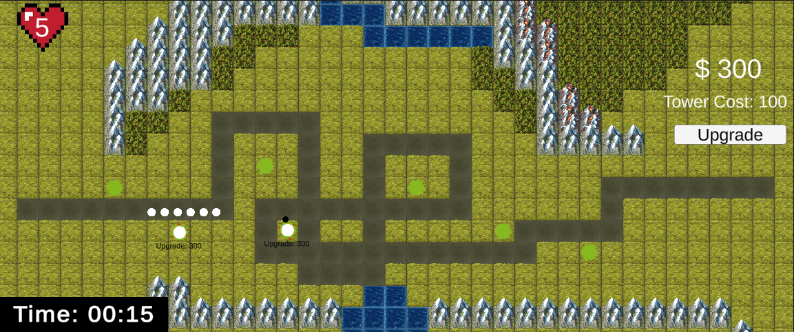

# TowerDefenseTemplate

Dit is mijn Tower Defense Opdracht voor de Beroeps Opdracht van Module 5
Deze Tower Defense werkt vrij simpel. wanneer je speelt klik je op een groen stipje om daar je tower op te plaatsen die je met geld koopt. De towers kan je upgraden met het geld die je van de enemies krijgt. Je begint met een standaard hoeveelheid en elke enemy die dood gaat geeft je meer. Het werkt in waves waardoor je na het doden van de enemies er dan nog een aantal bij komt die sterker zijn.

## Product 1: "DRY SRP Scripts op GitHub"

Plaats hier minimaal 1 link naar scripts die voldoen aan de eisen van **"Don't Repeat Yourself (DRY)"** en **"Single Responsibility Principle"**.
Omschrijf hier waarom jij denkt dat je in die scripts aan deze eisen voldoet.

*"In dit script heb ik een array gemaakt voor alle waypoints voor de path zodat ik mezelf niet hoef te herhalen met waypoints en met een paar regels kan zorgen dat ze langs elke waypoint gaan.
[link naar DRY]([/MyTowerDefenseGame/Assets/Scripts/JustAScript.cs](https://github.com/35615-Gino/TowerDefense-2D/blob/master/Tower%20Defense/Assets/Scripts/Path/Path.cs))"*

*"dit script is SRP omdat het gemaakt is om precies 1 ding te doen en dat is om het spel uit te gaan door op de button te klikken op het start scherm

[Link naar SRP](https://github.com/35615-Gino/TowerDefense-2D/blob/master/Tower%20Defense/Assets/Scripts/UI/Buttons/QuitButton.cs)

## Product 2: "Projectmappen op GitHub"

Je commit de mappenstructuur van je unity project op github en verwijst vanuit je readme naar de root map van je project. Met een netjes en goed gestructureerde mappenstructuur en benamingen van files toon je aan dat je dit leerdoel beheerst. 

Dit is de [ROOT]([/MyTowerDefenseGame/](https://github.com/35615-Gino/TowerDefense-2D/tree/Develop/Tower%20Defense)) folder van mijn unity project.

Zorg dat deze verwijst naar je Develop branch.

## Product 3: Build op Github

Je maakt in Unity een stabiele “build” van je game waarbij bugs en logs eerst zijn verwijderd. Deze buildfiles upload je in je repository onder releases.  Bij eventuele afwijkingen moeten deze worden gedocumenteerd in de release. (Bijv controller nodig of spelen via netwerk etc..) 

[Recente Release]([https://github.com/erwinhenraat/TowerDefenseTemplate/releases](https://github.com/35615-Gino/TowerDefense-2D/releases/tag/V.1.0.2))

## Product 4: Game met Sprites(animations) en Textures 

De build van je game bevat textures, sprites en sprite animations(bijv particles) die op de juiste manier zijn gebruikt en zorgen voor een goede afwerking van je game.  

Plaats in je readme een animated gif van je gameplay (+- 10 sec.) waarin de implementatie van je textures en sprites goed te zien is.

## Product 5: Issues met debug screenshots op GitHub 

Zodra je bugs tegenkomt maak je een issue aan op github. In de issue omschrijf je het probleem en je gaat proberen via breakpoints te achterhalen wat het probleem is. Je maakt screenshot(s) van het debuggen op het moment dat je via de debugger console ziet wat er mis is. Deze screenshots met daarbij uitleg over het probleem en de bijhorende oplossing post je in het bijhorende github issue. 
[Hier de link naar mijn issues](https://github.com/erwinhenraat/TowerDefenseTemplate/issues/)

## Product 6: Game design met onderbouwing 

Je gebruikt een game design tool om je game design vast te leggen en te communiceren. Daarnaast onderbouw je de design keuzes ten aanzien van “playability” en “replayability” voor je game schriftelijk. 

Voorbeeld van een one page design:

*  **Je game bevat torens die kunnen mikken en schieten op een bewegend doel.** 

*Mijn torens hebben ook nog een f.o.v waardoor je pas gaan mikken als enemies in de buurt zijn. ook hebben mijn torens geen 360 graden view maar 90 graden waardoor het een extra uitdaging is voor de speler om de torens ook op de meest tactische manier te roteren.*

*  **Je game bevat vernietigbare vijanden die 1 of meerderen paden kunnen volgen.**  

*Ik heb 2 verschillende soorten enemies: 
1 die niet snel is maar ook niet veel health heeft en de tweede heeft meer health en is iets langzamer*

*  **Je game bevat een “wave” systeem waarmee er onder bepaalde voorwaarden (tijd/vijanden op) nieuwe waves met vijanden het veld in komen.**

*Mijn game heeft een wave systeem waar de wave om een paar seconden begint die dan een hoeveelheid enemies spawnt met een spawn interval om het niet tegelijkertijd te spawnen en als de enemies dood zijn wacht je een paar seconden en dan begint de volgende wave en dat gaat door totdat de waves klaar zijn.*

*  **Een “health” systeem waarmee je levens kunt verliezen als vijanden hun doel bereiken en zodoende het spel kunt verliezen.** 

*de game heeft een health system van dat elke keer dat een enemy langs de finish line komt dat ze dan 1 leven van je er af halen totdat je geen levens meer hebt*

*  **Een “resource” systeem waarmee je resources kunt verdienen waarmee je torens kunt kopen en .evt upgraden.**

*je begint met een standaard hoeveelheid van de resource om towers van te kopen en elke keer dat een enemy dood gaat krijg je meer om ze dan te upgraden*

*  **Een “upgrade” systeem om je torens te verbeteren.**

*de towers kunnen geupgrade worden die dan sneller schieten maar even veel damage doen*

## Product 7: Class Diagram voor volledige codebase 

Je brengt je volledige codebase in kaart met behulp van een class diagram. Binnen de classes hoeven geen private members te worden weergegeven. Wel alle public members (fields en methods). Ook geef je indien relevant de relaties tussen je classes weer. Je class diagram plaats je in je readme op github. Evt mag je dit doen m.b.v de [Class Diagram](readmeVisuals/UMLclass.png) tool.

## Product 8: Prototype test video
Je hebt een werkend prototype gemaakt om een idee te testen. Omschrijf if je readme wat het idee van de mechanics is geweest wat je wilde testen en laat een korte video van de gameplay test zien. 

## Product 9: SCRUM planning inschatting 

Je maakt een SCRUM planning en geeft daarbij een inschatting aan elke userstory d.m.v storypoints / zelf te bepalen eenheden. (bijv. Storypoints, Sizes of tijd) aan het begin van een nieuwe sprint update je deze inschatting per userstory. 

Plaats in de readme een link naar je trello en **zorg ervoor dat je deze openbaar maakt**

[Trello board](https://trello.com/b/F4jPmW7X/sd2a-bo-scrum)
## Product 10: Gitflow conventions

Je hebt voor je eigen project in je readme gitflow conventies opgesteld en je hier ook aantoonbaar aan gehouden. 

De gitflow conventions gaan uit van een extra branch Develop naast de "Master"/"Main". Op de main worden alleen stabiele releases gezet.

Verder worden features op een daarvoor bedoelde feature banch ontwikkeld. Ook kun je gebruik maken van een hotfix brancg vanaf develop.

Leg hier uit welke branches jij gaat gebruiken en wat voor namen je hier aan gaat meegeven. Hoe vaak ga je comitten en wat voor commit messages wil je geven?

Meer info over het gebruiken van gitflow [hier](https://www.atlassian.com/git/tutorials/comparing-workflows/gitflow-workflow)
